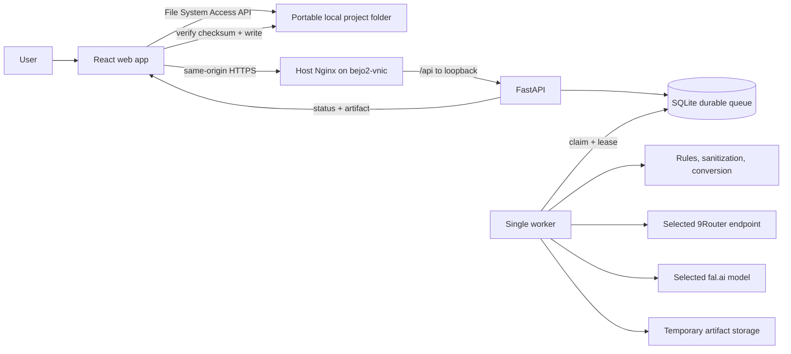

# Architecture — Gandiwa Studio

**Baseline:** `mvp-1.0`

**Status:** LOCKED

**Development:** `bejo1-oracle`

**Production:** `bejo2-vnic`

## System Boundary

Gandiwa Studio adalah local-first browser application dengan processing backend. Pengguna memilih konektor dan model secara eksplisit untuk setiap job. Gandiwa tidak melakukan cross-provider routing, fallback, load balancing, combo ordering, atau automatic model selection.



## Ownership Boundaries

- **Browser owns project filesystem access.** Backend remote tidak dapat menggunakan directory handle laptop.
- **Portable manifest is source of truth.** `gandiwa-project.json` dan path relatif membawa state kreatif portabel.
- **SQLite owns backend runtime state.** Konfigurasi, cache/index, queue, lease, event, dan temporary artifact metadata berada di backend.
- **API owns secrets and sessions.** Credential tidak masuk browser bundle, manifest, artifact, atau log.
- **Worker owns long-running execution.** FastAPI hanya memvalidasi dan mengantrekan job; tidak menunggu provider di request lifecycle.
- **9Router is one connector.** Routing/combo/fallback internalnya berada di luar Gandiwa.
- **Cloud sync is not a product feature.** Sinkronisasi folder yang dipilih pengguna berada di luar MVP.

Keputusan filesystem mengikuti [ADR-0002](adr/0002-local-first-browser-filesystem.md).

## Planned Repository Modules

### `apps/web`

React + TypeScript strict + Vite. Memuat project picker, content classification, generation form, queue/status, candidate comparison, lightweight SVG editor, audit center, metadata editor, dan export gate.

- Zustand: UI-only state.
- TanStack Query: API/server/job state dan REST polling.
- React Router: client-side navigation.
- Tailwind CSS + CSS variables: token `DESIGN.md`.
- File System Access API: folder project, revision, dan export.

### `apps/api`

Python 3.12 + FastAPI. Memuat session authentication, provider registry, capability validation, queue service, artifact endpoint, ruleset execution, sanitization, audit orchestration, conversion, dan redacted event logs.

API dan worker memakai application package yang sama, tetapi berjalan sebagai proses berbeda.

### `packages/contracts`

Versioned manifest, API, job, provenance, audit, approval, export, dan artifact schemas. Kontrak lintas TypeScript/Python tidak boleh drift; mekanisme code generation atau conformance fixtures dipilih saat scaffold.

### `packages/adobe-rules`

Versioned deterministic rules dan fixtures yang berkorespondensi dengan `ADOBE-RULESET.md`.

### `packages/provider-sdk`

Connector interface untuk connector backend yang dikonfigurasi operator dan model pilihan pengguna. Package ini dilarang menyediakan routing, fallback, load balancing, combo ordering, atau automatic provider selection.

### `packages/ui`

Shared accessible components dari `DESIGN.md`.

## Required Data Flow

### Open/Create Project

1. Browser meminta directory handle dengan aksi eksplisit pengguna.
2. Browser memvalidasi permission dan manifest.
3. Untuk project baru, browser hanya menginisialisasi folder yang kosong saat inspeksi dan dipilih pengguna secara eksplisit; folder berisi ditolak sebelum write. File System Access API tidak menyediakan lock atau create-exclusive lintas tab/proses, maka folder yang sedang diinisialisasi tidak boleh diubah proses lain. Ia menulis temporary manifest dan manifest final sebagai commit marker terakhir; bila cleanup/write gagal, folder pilihan dipertahankan dan pengguna diminta memeriksanya, bukan dihapus otomatis. Atomic replace hanya dipakai jika primitive filesystem/browser nanti benar-benar mendukungnya.
4. Path absolut tidak disimpan.
5. Backend yang unavailable tidak menghalangi pembukaan data lokal; fitur backend ditandai unavailable.

### Submit Long-Running Job

1. Pengguna memilih content type, creation method, connector, model, dan format valid.
2. Browser mengirim hanya input yang diperlukan melalui same-origin HTTPS.
3. API memvalidasi capability dan membuat immutable ruleset snapshot.
4. API menyimpan job `queued` pada SQLite lalu segera mengembalikan `job_id`.
5. Worker claim berdasarkan priority+FIFO dalam transaksi singkat dan memasang lease.
6. Worker menjalankan tepat konektor yang dipilih, menyimpan `remote_job_id`, dan memperbarui heartbeat/status.
7. Browser memantau melalui REST polling.
8. Worker menaruh hasil pada temporary artifact storage dengan checksum dan expiry.
9. Browser mengambil, memverifikasi checksum, dan menulis artifact ke folder proyek.
10. Artifact backend dibersihkan setelah retrieved/expiry sesuai retention policy.

### Audit and Export

1. Source tidak pernah ditimpa; edit membentuk revision baru.
2. Sanitasi dan deterministic checks berjalan sebelum render/export.
3. AI review dilabeli risk screening, bukan fakta/legal clearance.
4. Edit artwork atau metadata relevan membuat audit/approval sebelumnya stale.
5. Export diblokir sampai revision/checksum terkini lulus blocking checks, metadata/disclosure lengkap, dan human approval valid.

## Queue and Recovery

Keputusan lengkap mengikuti [ADR-0001](adr/0001-sqlite-durable-job-queue.md).

```text
QUEUED → RUNNING → WAITING_PROVIDER → PROCESSING → SUCCEEDED
                    ↘ NEEDS_REVIEW / FAILED / CANCELLED
```

- Satu worker dan satu job aktif untuk MVP.
- Claim order: priority lalu FIFO.
- Lease + heartbeat mendeteksi worker mati.
- Recovery tidak boleh mendispatch ulang generation request jika outcome provider belum diketahui.
- Retry hanya untuk operasi aman/idempotent.
- Cancel bersifat cooperative dan diteruskan ke provider jika tersedia.
- REST polling digunakan pada MVP; SSE/WebSocket ditunda.

## Deployment Boundary

Production mengikuti [ADR-0003](adr/0003-bejo2-production-topology.md) dan `DEPLOYMENT-BEJO2.md`.

```text
bejo1-oracle: development + review via VS Code Remote SSH
bejo2-vnic : host Nginx + Docker Compose API/worker + SQLite
```

- Vite menghasilkan static frontend; tidak ada Node server production.
- Nginx menggunakan dedicated Gandiwa HTTPS virtual host dan meneruskan `/api/` ke loopback `127.0.0.1:8010`.
- API dan worker berjalan pada image `linux/arm64`.
- Existing `komputermu.my.id` dan port 3000 tidak boleh terganggu.
- 9Router dapat berada di host lain dan diakses melalui tailnet.
- AI inference tetap pada provider; tidak dijalankan lokal.

## Security Baseline

- Same-origin HTTPS dan secure server-side session.
- Tailscale serta CORS bukan pengganti autentikasi aplikasi.
- State-changing route memiliki CSRF protection sesuai session model.
- SVG dianggap hostile active content; DTD/entity eksternal, script, event handler, `foreignObject`, external resource, dan dangerous URI ditolak sebelum preview.
- SVG mentah/upload tidak pernah disajikan dari Nginx document root atau sebagai inline same-origin content. Preview default berupa raster hasil backend; download SVG tervalidasi memakai endpoint terautorisasi, `Content-Disposition: attachment`, `X-Content-Type-Options: nosniff`, nama file aman, dan checksum.
- Parsing/render dibatasi byte, dimensi/pixel, node/depth, waktu, output, dan network access; file gagal masuk quarantine sementara sampai cleanup.
- Upload/artifact dibatasi ukuran, waktu, media type, dan checksum; file besar di-stream.
- Temporary artifact memiliki expiry dan cleanup aman.
- Provider URL mengikuti allowlist/SSRF policy: default HTTPS, pengecualian sempit untuk 9Router Tailscale, validasi DNS/IP, redirect lintas-origin nonaktif, dan secret terikat pada connector/origin.
- Authorization, cookie, key, dan secret selalu diredaksi.
- API container tidak diekspos publik; ingress hanya melalui Nginx.
- Ruleset berversi dan bukti blocking decision dipertahankan.

## Reliability Invariants

- Manifest write bersifat atomic bila filesystem mendukung.
- Source immutable; revision/checksum dapat ditelusuri.
- SQLite memakai foreign keys, WAL, dan busy timeout pada local disk.
- Migration dilakukan sebagai release step, bukan destructive startup shortcut.
- API/worker restart tidak menghilangkan antrean.
- Provider request tidak diulang jika dapat menimbulkan biaya ganda tanpa bukti idempotensi.
- Browser yang ditutup tidak membatalkan job backend; hasil tetap temporary sampai diambil atau expired.

## Architecture Decision Records

Material changes berada di `docs/adr/`. Perubahan scope, boundary, database, queue, deployment target, atau provider semantics membutuhkan ADR dan persetujuan pemilik produk.