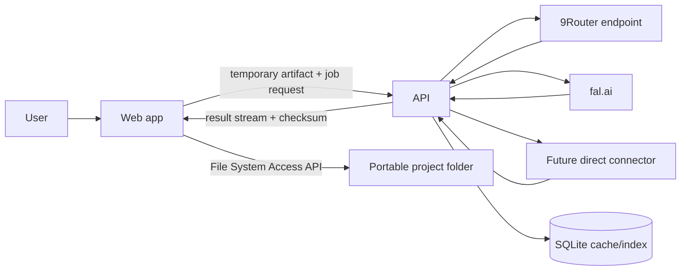

# Architecture

## System Boundary

Gandiwa Studio is a web client plus a processing API. It does not route requests among AI providers. The user explicitly selects a configured connector and model for each job.

## Ownership Boundaries

- **Browser owns filesystem access.** A remote API cannot write directly to the laptop directory handle.
- **Portable manifest is source of truth.** SQLite is a rebuildable cache/index and runtime job store.
- **API owns secrets.** Provider credentials never enter browser bundles, project manifests, artifacts, or logs.
- **9Router is one connector.** Any combo, fallback, or routing behind it remains outside Gandiwa.

## Planned Modules

### `apps/web`
Project picker, content classification, generation form, candidate comparison, lightweight SVG editor, audit center, metadata editor, and export gate.

### `apps/api`
Authentication, connector registry, capability validation, temporary artifact processing, ruleset execution, sanitization, audit orchestration, and redacted job logs.

### `packages/contracts`
Versioned request/response, manifest, job, provenance, audit, approval, and export schemas.

### `packages/adobe-rules`
Versioned deterministic rules and fixtures corresponding to `docs/ADOBE-RULESET.md`.

### `packages/provider-sdk`
Connector interface only. It does not provide cross-provider routing, fallback, or automatic model selection.

### `packages/ui`
Shared accessible components derived from `docs/DESIGN.md`.

## Required Data Flow

1. Browser obtains a directory handle with explicit user permission.
2. User selects content type, creation method, connector, model, and valid working format.
3. API snapshots the active ruleset before dispatch.
4. Browser uploads only required inputs to temporary API storage.
5. API calls exactly the selected connector and returns artifacts plus provenance/checksum.
6. Browser writes artifacts to the project folder.
7. Every edit creates a revision and invalidates stale audit/approval records.
8. Export is blocked until the current checksum passes the final gate.

## Security Baseline

- Treat SVG as hostile active content; reject scripts, event handlers, and external resources before preview.
- Use secure session authentication; Tailscale and CORS are not authentication.
- Redact authorization headers and secrets.
- Bound upload size and duration; stream large artifacts.
- Delete temporary server artifacts under an explicit retention policy.
- Pin ruleset versions and preserve evidence for blocking decisions.

## Architecture Decision Records

Material changes belong in `docs/adr/` using the template there. MVP scope changes require owner approval and synchronized BRD/PRD/ERD/ruleset updates.
