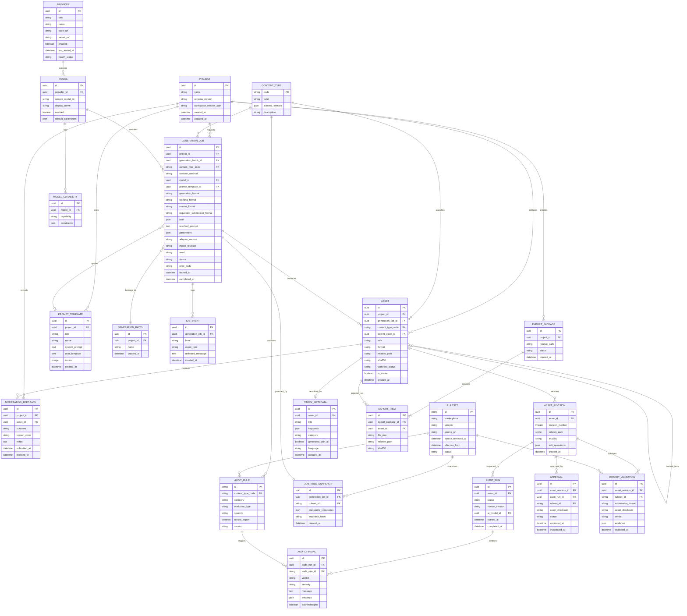

# Entity Relationship Diagram — Gandiwa Studio

**Versi:** 1.0  
**Cakupan:** Model data MVP single-user

## Prinsip Penyimpanan

Gandiwa memakai dua lapisan data:

1. **Filesystem pengguna** melalui File System Access API untuk source, hasil generasi, revisi, preview, export, dan manifest proyek.
2. **Database backend SQLite** untuk konfigurasi provider, model capability, job runtime, audit rules, dan catatan operasional.

API key tidak boleh masuk `gandiwa-project.json`, database dalam folder proyek, atau log. Secret disimpan melalui environment variables atau secret store backend.

## Diagram ERD



## Kamus Nilai Penting

### `CONTENT_TYPE.code`

| Nilai | Arti | Format generasi MVP |
|---|---|---|
| `photo` | Konten bergaya fotografi | `png`, `jpeg` |
| `illustration` | Ilustrasi raster atau native vector | `png`, `jpeg`, conditional `svg` |
| `vector` | Artwork vector native | `svg` |

### `GENERATION_JOB.status`

`queued`, `running`, `succeeded`, `failed`, `cancelled`.

### `ASSET.role`

`source`, `candidate`, `master`, `revision`, `preview`, `final`.

### `ASSET.workflow_status`

`generated`, `selected`, `editing`, `audit_failed`, `needs_review`, `approved`, `ready_for_export`, `exported`.

### `AUDIT_FINDING.verdict`

`pass`, `warning`, `fail`, `not_applicable`.

### `MODERATION_FEEDBACK.outcome`

`pending`, `accepted`, `rejected`, `removed`.

## Relasi dan Aturan Integritas

1. Satu asset memiliki tepat satu content type dan tidak boleh menggantinya setelah dibuat.
2. `creation_method` wajib dicatat terpisah dari content type.
3. Perubahan content type menghasilkan generation job dan asset baru.
4. Setiap job wajib memiliki immutable `JOB_RULE_SNAPSHOT` sebelum request dikirim.
5. Generation, working, master, dan submission format disimpan terpisah.
6. Hanya satu asset master aktif per generation batch; pergantian master dicatat.
7. Revision tidak menimpa source; nomor revision unik per asset.
8. Audit, approval, dan export validation terikat pada revision, ruleset, serta checksum tertentu.
9. Edit artwork atau metadata relevan membuat approval/export validation lama berstatus stale/invalid.
10. Asset hanya dapat menjadi `ADOBE_READY` jika blocking rules PASS, metadata/disclosure lengkap, dan approval terkini valid.
11. `secret_ref` hanya menunjuk secret server-side, bukan berisi key.
12. Penghapusan provider tidak menghapus riwayat job; provider dinonaktifkan atau disoft-delete.
13. Audit AI menyimpan model yang digunakan agar hasil dapat ditelusuri.
14. Hash digunakan untuk integritas dan deteksi duplikasi; bukan sebagai satu-satunya similarity metric.
15. Manifest proyek adalah source of truth portabel; SQLite backend hanya cache/index/runtime state dan dapat dibangun ulang dari manifest.
16. Implementasi ruleset dan fixture mengacu pada `ADOBE-RULESET.md`.

## Struktur Folder Proyek

```text
GandiwaProject/
├── gandiwa-project.json
├── sources/
├── generated/
│   ├── photo/
│   ├── illustration/
│   └── vector/
├── revisions/
├── previews/
├── metadata/
├── reports/
└── exports/
```

Manifest menyimpan ID, path relatif, content type, format, status, dan referensi metadata. Secret serta path absolut tidak disimpan agar proyek portabel.
